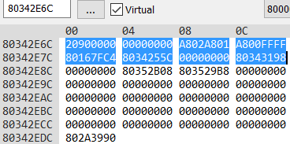
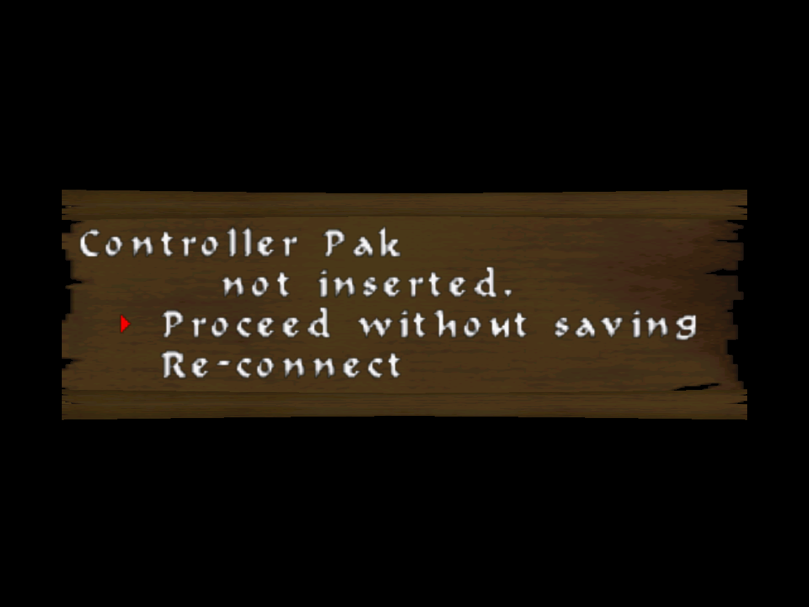
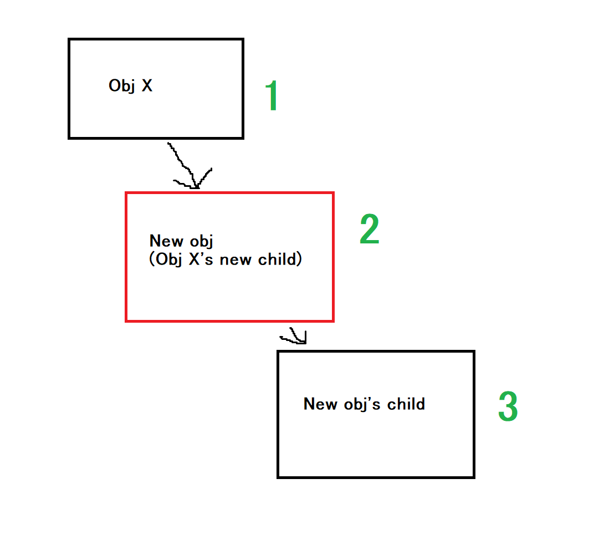

<!-- markdownlint-disable-next-line MD043 -->
# Objects

**Objects**[^1] are a common data structure seen through the game's code.

[^1]: Objects were formerly known as _modules_

An "object" has two main uses:

- modularize code execution flow
- assign code execution order

These are accomplished by associating code and data to objects that use them.
This means code can only execute when its associated object is present in
memory.

Almost every piece of code running in the main thread is associated to a certain
object (menus, enemies, the player, etc).

## Structure

<!-- markdownlint-disable-next-line MD033 -->
<div align="center">



_The Gardener's enemy object seen in memory using
[Project64's debugger](https://hack64.net/docs/pj64d/). Highlighted in blue
is the object's header._

</div>

All objects are `0x74` bytes long. The first `0x20` bytes consist of a header
that is used to track things, while the other `0x54` bytes can vary depending
on the object.

In this project, the object data structures and its associated functions are
declared in `object.h`.

```c
typedef struct cv64_object_func_inf {
    u8 timer;          // Could also be "number of accesses to function"
    u8 function;       // ID within the functions array
} cv64_object_func_inf_t;

typedef struct cv64_object_hdr {
    s16 ID;
    s16 flags;
    s16 timer;
    s16 field_0x06;
    cv64_object_func_inf_t current_function[3];
    s16 functionInfo_ID;
    void (*destroy)(void*); // Officially called "OBJ_destruct"
    struct cv64_object_hdr_t* parent;
    struct cv64_object_hdr_t* next;
    struct cv64_object_hdr_t* child;
} cv64_object_hdr_t;
```

### `ID`

This is a unique numeric identifier distinguishing the object from others, and
linking to the object's associated code and files (if any).

The `ID` also stores an execution flag. So, in reality this field is composed of
the following two things:

#### Upper 5 bits: Execution flags

```c
NONE         = 0x0000
STAGE_OBJECT = 0x1000
MAP_OVERLAY  = 0x2000
DESTROY      = 0x8000
```

- `STAGE_OBJECT`: notifies the game that the object is a _map actor_[^2].
Sometimes `0x1800` is used instead.

- `MAP_OVERLAY`: indicates that the code associated to the object needs to be
[mapped by the TLB](#code-mapped-by-the-tlb) to an address in [KUSEG](https://en64.shoutwiki.com/wiki/N64_CPU#CPU_Addressing).

- `DESTROY`: destroys the object[^3]. Once an object is destroyed, its code will
stop running.

[^2]: A map actor is an actor meant to be used in a certain map. This includes
most map-specific hazards or decorative elements.

[^3]: In practice, destroying an object means marking it for deletion. Doing so
has the effect of removing the object from memory next time the game attempts to
execute it.

#### Lower 11 bits: The actual identifier

For example, the Gardener's object ID is `0x2090`:

- `0x2000` = Execution flags (`MAP_OVERLAY`)
- `0x0090` = The actual identifier

There are a total of 554 object IDs assigned by KCEK, starting from 1. These can
all be found in `object_ID.h`

### `flags`

These are other sets of flags different from the ones specified above. At the
moment, only two are known:

```c
PAUSE = CV64_BIT(14),
TOP   = CV64_BIT(15)
```

- `PAUSE`: temporarily freezes the execution of the object's associated code.
- `TOP`: the only object known to have this flag is `GameStateMgr`. Other
than that, it does not seem to affect code execution.

### `timer`

This value is used by some objects as a timer for different purposes. For
example, the `interactuables` object[^4] uses this timer to know how much time
has passed before it can begin to disappear after awhile.

[^4]: The `interactuables` object handles pickable items and text spots that you
can read during gameplay when pressing C-Right on a Nintendo 64 controller.

### `current_function` and `functionInfo_ID`

See the section: [How the code of an object executes](#how-the-code-of-an-object-executes)

### `parent`, `child`, and `next`

See the section: [Execution tree](#execution-tree)

### `destroy`

This is a pointer to the object's `destroy` function. This function is called
when an object no longer needs to run, and destroys other structs associated to
it. This function is also responsible for setting the `DESTROY` flag.

## Execution

> [!NOTE]
> When it's said that an object is running, it's actually the code associated to
> it that runs, as the object struct itself does not contain code.

As mentioned before, every object has certain code associated to it, so in order
to execute it, said object must be spawned in memory.

### Execution tree

All objects are organized in a tree-like manner, where objects at the top are
executed first, followed by ones underneath it. To explain this further, let's
use the following diagram as an example.

This is how the execution tree looks when idling in the screen that appears when
booting the game with no Controller Paks plugged in:




Each box represents an object, where the number inside it is its `ID`. The
arrows pointing straight down / down-left represent the `next` pointer, whereas
the arrows pointing down-right are the `child` pointers. The numbers in red
represent the execution order of each object in the tree.

In the execution tree, objects are executed from top to bottom, **starting from
object ID 1** (`GameStateMgr`).

After an object is finished executing, it executes the `child` object if it has
one. Otherwise, it executes the `next` object.

This continues recursively until there are no more `child` / `next` objects left
to execute. After which, it goes back in the tree and executes the remaining
objects.

If there are none left, then the current frame is executed, and the cycle
repeats for the next frame.

### Objects array

All objects are allocated in the `objects_array`. This array has a total
capacity of 384 objects.

> [!NOTE]
> If the game attempts to allocate an object when the array is full, then said
> object will fail to spawn.

Objects are allocated sequentially on this array. The way the game determines a
slot is empty is by finding the first object slot in the array where the `ID`
value is 0 (remember, objects start from ID 1).

When objects are destroyed, their `ID`s are eventually set to 0, which tells the
game their slot is free for a new object to occupy.

## Object spawning and execution

### Spawning an object

There are two functions used to spawn an object in memory:

```c
void* object_create(void* parent, cv64_object_t ID);

void* object_createAndSetChild(void* parent, cv64_object_t ID);
```

On these functions, `parent` is the parent object, and `ID` is the identifier of
the new object to spawn.

The difference between these two functions resides in where they place the newly
created object within the execution tree.

#### `object_create`

The new object will be set as the `child` object of its parent, and the previous
`child` of the parent is now set as the new object's `child`

Essentially, this means the new object will now execute right after the parent,
and all of the parent's previous children will now execute after the new object.

##### Before calling `object_create`


##### After calling `object_create`



#### `object_createAndSetChild`

When an object is spawned through this function, it checks if the parent has any
`child` objects. If it does, it sets the new object as the last one in the
column of `next` objects from said child.

This makes it so that the newly created object will execute at the very bottom
of the list of objects from the parent's "branch".

##### Before calling `object_createAndSetChild`


##### After calling `object_createAndSetChild`


> [!IMPORTANT]
> The green numbers in the above image represent the order of execution. The box
> in red is the newly spawned object.

In both cases, if the function is called with `parent = NULL`, then a new
"branch", separate from the regular execution tree is created. In order to
execute the new "branch", you need to explicitly call `object_execute` on that
object, as it is not in the same "branch" as the one owned by `GameStateMgr`.
See below for more information.

### Executing an object's code

Once an object is spawned, its code will automatically begin execution in the
next frame.

In order to execute an object, the game calls `object_execute` to execute an
object's associated code and all its `child` / `next`.

```c
void object_execute(cv64_object_hdr_t* object);
```

`object` is the pointer to the object at the beginning of the "branch".

For example, if calling `object_execute` and passing the pointer to `Obj X` as
the argument, all objects in the diagram will execute one frame worth of code.

However, if the same function is called with `Obj A`'s pointer as the argument,
then only `Obj A` and `Obj B` will execute.


In practice, `GameStateMgr` (object ID 1) is always the top-most object in the
execution tree, so any `child` / `next` objects that come down from it will
automatically execute; no need to explicitly call `object_execute` on the newly
spawned object.

#### `Objects_functions`

In order to know where the code associated to said object is located, the
[identifier part](#lower-11-bits-the-actual-identifier) of its `ID` is used as
an index into an array known as `Objects_functions`.

This is an array of 554 function pointers (one per object) containing the
beginning of the object's associated code. Each entry in this array is called an
`entrypoint` function.

Every frame, the game iterates through all the objects allocated in
`objects_array`, looks for its `entrypoint` function, and executes it.

##### Code mapped by the TLB

Most [overlays](https://en.wikipedia.org/wiki/Overlay_(programming)) are loaded
dynamically in memory before executing[^5]. And when they're not needed anymore,
they're unloaded.

[^5]: This is to say, most overlays are only loaded into memory when needed
(e.g. the code associated to an enemy that only appears on specific maps).

Because this code is loaded dynamically, the address of its `entrypoint`
function is not guaranteed to be constant. This is problematic because
`Objects_functions` only stores a single address meant to be constant during
gameplay.

In addition, overlays are compiled with a specific `entrypoint` address
that, if changed, can make the code work improperly[^6].

[^6]: Things such as branch assembly instructions can only work if the overlay
is loaded into the same `entrypoint` address it was compiled to, otherwise it
will likely branch to unintended places in memory and crash the game.

In order to fix this issue, the developers chose to map the code for overlays
to certain addresses within the KUSEG segment (most commonly addresses
`0x0F000000` and `0x0E000000`) before the execution of its code begins.

This makes the CPU think dynamically loaded overlay code is stored at
`0x0F000000` / `0x0E000000`. And, if the overlay code is compiled with the
`entrypoint` address set to any of those values, execution will work properly.

Thus, all overlays were compiled with the `entrypoint` address set to
`0x0F000000`, except for the cutscene-related overlays, which were compiled with
address `0x0E000000` instead.

### How the code of an object executes

As previously said, every object has an associated `entrypoint` function, which
is **guaranteed to execute** as long as the object is in memory.

For most objects, this function is used to branch into another set of functions,
depending on the current "state" of the object, so to speak.

This set of functions is stored as function pointers arrays, each one with an
ID. This is where the `current_function` variable of the object's header comes
into play.

`current_function` consists of two fields:

- `timer`: measures for how long the function has been executed. When reaching
the max value (255), it rolls back to 0.

- `function`: ID of the function pointer entry inside the array mentioned above.
The game uses this to know which one of the object's specific functions to
execute.

An object can have up to three "levels" of function pointers to execute
functions from, so the game will first execute the functions in level 0, then
level 1, then level 2, if needed. The `functionInfo_ID` variable in the object
header is used to know which level to look at (set to -1 by default).

An example of all three levels being used can be found in the Player's actor,
assigning "states" and "substates" to the player's actions. For example, level 0
contains the ID of the main "state" function (i.e. JUMP). Level 1 contains the
ID of the specific "substate" of said state (for example, in the case of
jumping, a function for propelling up, another function for falling down, etc).

#### Example: Konami / KCEK Logo

The function pointers array for the Konami / KCEK logo object looks like this:

```c
cv64_ovl_konamilogo_func_t cv64_ovl_konamilogo_funcs[] = {
    cv64_ovl_konamilogo_init,          // 0
    cv64_ovl_konamilogo_fade_in,       // 1
    cv64_ovl_konamilogo_wait,          // 2
    cv64_ovl_konamilogo_fade_out,      // 3
    cv64_ovl_konamilogo_kcek_fade_in,  // 4
    cv64_ovl_konamilogo_kcek_wait,     // 5
    cv64_ovl_konamilogo_kcek_fade_out, // 6
    func_8000E860                  // 7
};
```

So, if `current_function[0].function` for the Konami / KCEK logo object is equal
to 0, then it will execute the `cv64_ovl_konamilogo_init`. If it's 1, it will
execute `cv64_ovl_konamilogo_fade_in`, and so on.

The function ID in the `function` field will always be executed until its
changed. In order to change it, there are various functions the devs used, but
the most commonly used ones are:

- `object_curLevel_goToNextFuncAndClearTimer`: branches to the next function in
the array (i.e. `function++`)

- `object_curLevel_goToFunc`: branches to a specific function ID within the
array, specified by the third argument (i.e. `function = ID`)

## Groups

All objects are grouped based on their intended usage. Depending on the group,
the objects may have a different structure layout, and they may be assigned
different _parent_ objects when spawned.

- **Engine / Game States**: engine related tasks, and the "main" object of a
game state
- **Cutscenes**: cutscenes, and cutscene-related tasks
- **Cameras**: camera-related tasks
- **Player**: player actors, and player-related objects
- **Enemies**: enemies meant to spawn in different maps
- **Effects**
- **Menus**
- **Maps**: map-handling tasks (objects handling the culling of map pieces /
chunks, and the creation of the map's collision)
- **Map Actors**: actors meant for use in one single map (enemies, hazards,
decorative elements)

The headers for these objects are stored inside `include/game/objects`, in one
directory per category.

## Loading files

Objects can have files associated to them, usually overlays and assets files.

The game references the `objects_file_info` array to know which files to load
from the [Nisitenma-Ichigo table](./compression.md#nisitenma-ichigo-table). This
array has 554 entries (one per object). Each entry is a pointer to an array of
the struct `objectsFileInfo`:

```c
#define OBJECTS_FILE_INFO_END_OF_LIST 0x4000

typedef struct {
    u16 flags;
    u16 file_ID;
    u32 file_padding;
} objectsFileInfo;
```

For example, the Gardener's `objectsFileInfo` array is as follows:

```c
#define GARDENER_OVERLAY 0x74
#define GARDENER_ASSETS  0x0C

// 0x80095A50 (USA v1.0)
objectsFileInfo gardener_files[] = {
    {0, GARDENER_OVERLAY, 0x1000},
    {OBJECTS_FILE_INFO_END_OF_LIST, GARDENER_ASSETS, 0}
};
```

When the Gardener object is spawned, the game goes to that array and loads each
of its files until the last entry, which is marked by the
`OBJECTS_FILE_INFO_END_OF_LIST` flag.
